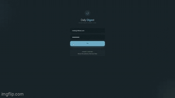

# Daily Digest

A high-precision fluid and nutrition tracking dashboard designed for clinical accuracy and pattern recognition.

**Link to project:** https://daily-digest-sigma-mocha.vercel.app/

    

**Tech used:** React.js, Tailwind CSS, DaisyUI, Supabase

## User Story:

As a user managing a medical condition or a strict fitness regimen, I need a frictionless way to track my daily fluid intake and output. I want to see a "Net Balance" of my hydration at a glance so I can recognize patterns in my health, while also maintaining a food journal to track nutrition. I need the app to be accessible on the go (mobile) and provide a detailed historical review on desktop.

## How It Works:

* Dashboard Snapshot: The top of the app displays a real time "Daily Snapshot" of total intake (cc), total output (cc), and the calculated Net Balance.

* Quick Action Center: Users can instantly log urine output, water intake, or food entries using specialized input cards.

* Historical Pattern Recognition: A collapsible history section groups data by date, allowing users to expand notes and edit past entries.

* Adaptive Interface: The app features a high end UI that shifts between Light and Dark modes to reduce eye strain during late night logging.

## How It's Made:

Daily Digest was built using a Component Driven Architecture. By breaking the UI into atomic pieces like StatChange and DailyStats, I ensured the codebase remains scalable and easy to debug.

* Feature Rich Interface: The app includes real time calculation of fluid differentials, a sophisticated food journal with expandable note cards, and a paginated history log.

* Dual Theming (Light/Dark): Utilizing Tailwind CSS and DaisyUI, I implemented a theme switching system. This wasn't just for aesthetics, but for users tracking medical data at night, the Dark Mode provides essential accessibility by reducing glare.

* Medical Precision: Unlike standard fitness apps, I standardized all fluid inputs to cc (cubic centimeters) to ensure clinical level data entry and zero ambiguity for the user.

## Optimizations:

While the current version of Daily Digest is fully functional, I have identified several key areas for future improvement:

* Data Visualization: Integrating Chart.js to turn the historical tables into visual line graphs for easier pattern recognition.

* Server Side Pagination: As the user’s history grows into the thousands, I would move the pagination logic from the client side to the backend to maintain lightning fast load times.

* Push Notifications: Adding reminders for users to log their intake if a long period of inactivity is detected.

* Export Functionality: The ability to export a week’s worth of data into a PDF or CSV format to share directly with a healthcare provider.

## Lessons Learned:

This project served as my introduction to advanced React performance optimization and the architecture of scalable state management.

**The Power of useMemo**

The most significant breakthrough was learning when and why to use the useMemo hook.

* The Problem: I noticed that the "Hydration Balance" logic was re-calculating the entire history of "In vs. Out" every time the user typed a single letter into a note field.

* The Solution: I implemented useMemo to "memoize" (cache) the results of these expensive calculations.

* When to Use It: I learned that useMemo should be used when you have a complex calculation that relies on specific data (like an array of stats). By using it, React only re-runs that logic when the actual data changes—not every time the component re-renders. This keeps the UI feeling snappy and professional even as data grows.

**Global State Orchestration via Context API**

In previous projects, data was passed linearly. For Daily Digest, I needed a "Single Source of Truth" that could be accessed by any component at any time.

* Implementing StatsProvider: I developed a custom StatsProvider using the React Context API. This allowed me to wrap the entire application in a data "bubble" where hydration stats, food logs, and CRUD functions are globally available.

* Eliminating Prop Drilling: This architecture prevented "prop drilling"—the tedious process of passing data through components that don't need it. Whether a user adds a log in a small popup or views a summary in the header, every component stays perfectly in sync because they are all consuming from the same Context.

* Stateful Logic: I learned how to encapsulate complex asynchronous logic (like database fetching and error handling) directly within the Provider, keeping the UI components clean and focused strictly on rendering.

